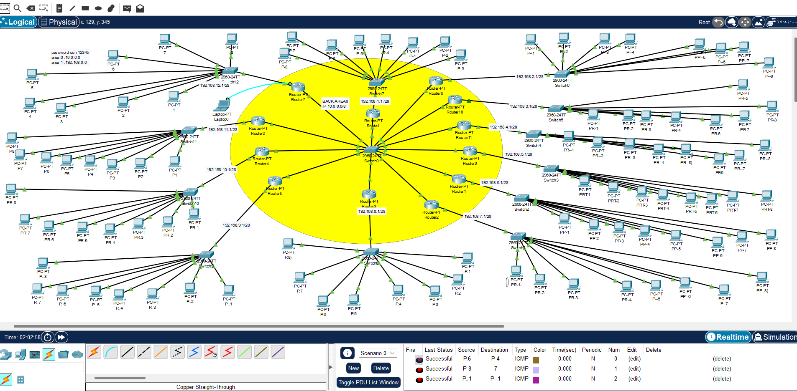

# مشروع تكوين شبكة باستخدام OSPF

تكوين شبكة تعتمد على بروتوكول التوجيه الديناميكي **OSPF** لتبادل معلومات المسارات بين الراوترات تلقائيًا، مع تقسيم الشبكات إلى **Area** لتسهيل إدارة التوجيه وتحسين الأداء.

- **Area 0 – الشبكة الأساسية (Backbone):** 10.0.0.0/8، تربط جميع الشبكات الأخرى.  
- **Area 1:** تحتوي على جميع الشبكات الفرعية لتسهيل التوجيه الداخلي.

---

## 2️⃣ مكونات الشبكة
- **الراوترات:** 12  
- **السويتشات:** 13  
- **أجهزة الكمبيوتر (PCs):** 8 أجهزة لكل شبكة فرعية

---

## 3️⃣ تقسيم الشبكات الفرعية (Subnets)

| #  | الشبكة           | قناع الشبكة الفرعية | عدد الأجهزة | الـ Area |
|----|-----------------|------------------|------------|----------|
| 0  | Backbone        | 10.0.0.0 /8      | -          | 0        |
| 1  | 192.168.1.0     | /28              | 8          | 1        |
| 2  | 192.168.2.0     | /28              | 8          | 1        |
| 3  | 192.168.3.0     | /28              | 8          | 1        |
| 4  | 192.168.4.0     | /28              | 8          | 1        |
| 5  | 192.168.5.0     | /28              | 8          | 1        |
| 6  | 192.168.6.0     | /28              | 8          | 1        |
| 7  | 192.168.7.0     | /28              | 8          | 1        |
| 8  | 192.168.8.0     | /28              | 8          | 1        |
| 9  | 192.168.9.0     | /28              | 8          | 1        |
| 10 | 192.168.10.0    | /28              | 8          | 1        |
| 11 | 192.168.11.0    | /28              | 8          | 1        |
| 12 | 192.168.12.0    | /28              | 8          | 1        |

---

## 4️⃣ إعدادات الوصول
- **كلمة مرور Console:** 12345  
- كل راوتر متصل بسويتش مركزي (**Switch0**) لتسهيل إدارة بروتوكول OSPF وربط الشبكات بـ Area 1 وBackbone (Area 0).

---

## 5️⃣ ملاحظات
- تم تمييز Backbone (Area 0) باللون الأصفر في الصورة لتوضيح أنه يربط كل الشبكات الفرعية.  
- تم اختبار الاتصال بين الأجهزة والراوترات باستخدام `Ping` بنجاح، مما يؤكد صحة إعداد OSPF.  
- كل شبكة فرعية تحتوي على 8 أجهزة نهائية.  

---

المشروع تم رفعه في المستودع.

**المنطقة الصفراء (Backbone - شبكة رئيسية تربط كل الراوترات.**

.**كل سويتش + الأجهزة المتصلة به - شبكة فرعية**

**(Subnet)**

**كل الراوترات الـ 12 متصلة هنا، وهذه هي الشبكةالرئيسية (10.0.0.0/8)**

**وظيفتها ربط كل الشبكات الفرعية ببعضها وتسهيل التوجيه بين المناطق**
**يربط كل الراوترات ببعضها (0) Backbone**
كل Router Switch PCS توضح توزيع
الشبكة الفرعية على الأجهزة.
